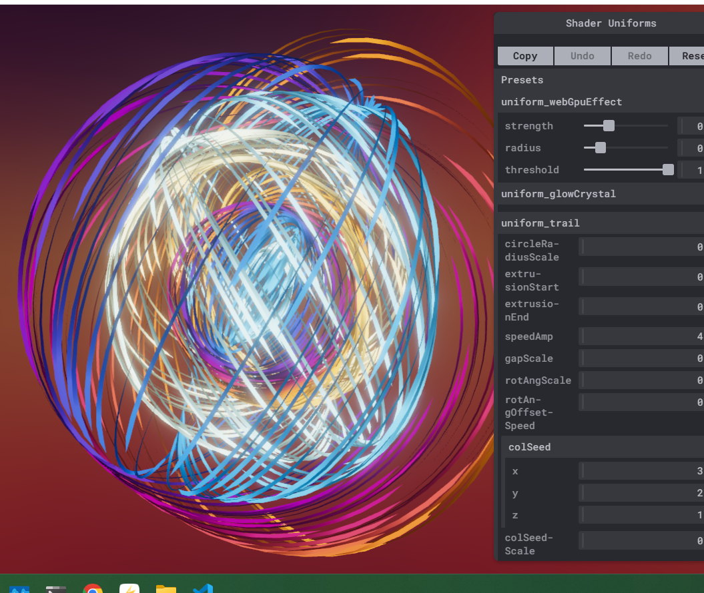
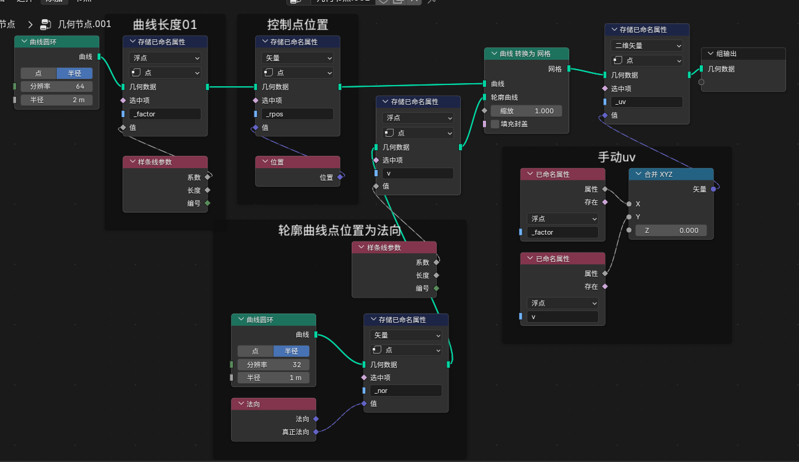

# threejs-vite-template

> 使用blender几何节点获取圆环的一系列属性
- _factor 样条线参数,也就是主环曲线的长度01,用来设置圆环挤出范围
- _rPos 主环控制点位置,用来设置主环缩放(轮廓曲线不缩放)
- _nor 轮廓曲线的点的位置,也就是主环法向
- _uv 因为几何节点导出的模型,没有uv,这里手动拼接uv,u为主环曲线长度_factor,v为轮廓曲线样条线长度01
  
> 如果默认轮廓曲线半径为0,会导致法向丢失,所以不能默认半径为0,然后按照法向方向挤出(偏移顶点).所以我反着来,默认半径为1,然后压缩,即使一条环线所有点都压缩到一个点,threejs还是会显示这部分,所以在colNode中discard丢弃这部分